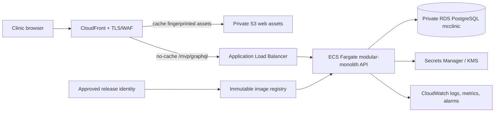

# MCClinic deployment readiness plan

Status: TASK-026 planning baseline, 2026-09-13. No infrastructure, deployment, external mail, live payment or production-data use is authorized.

## Recommendation

Use AWS Asia Pacific (Singapore, `ap-southeast-1`) as the first candidate for measured synthetic staging. Serve the built React Native Web assets from private S3 through one CloudFront distribution. Route `/mvp/graphql` through the same hostname to an Application Load Balancer and one ECS Fargate ARM task. Keep PostgreSQL `mcclinic` on private RDS. Disable caching for GraphQL, account links and clinical documents; only fingerprinted public web assets are cacheable.

This provides staging/production parity and a clean path to two API tasks and Multi-AZ RDS. It costs more than one VM. A $12/month Lightsail 2 GB VM plus single-AZ RDS is the fallback for a time-limited synthetic demonstration where lower price outweighs managed rollbacks and multi-AZ API availability. Do not use Kubernetes or split the modular monolith.

Singapore is a candidate, not a latency or data-residency conclusion. CloudFront has Manila edge presence and can improve static delivery/TLS connection reuse, but every clinical read/write still needs internet and an origin round trip. Measure Manila, Cebu and Davao—or the actual launch locations—on the intended fixed and mobile providers before accepting the region. Compare Singapore with a second measured candidate such as Jakarta; keep all patient-bearing services in one approved region.

## Environments and release boundary

| Environment | Data/access | Runtime | Database | Purpose |
|---|---|---|---|---|
| Local | Synthetic; loopback only | Existing local entry point/Vite | Local `mcclinic` | Development and automated checks |
| Synthetic staging | Synthetic only; explicit tester allowlist plus normal application login/MFA | Immutable API image; built web assets | Separate single-AZ RDS `mcclinic` | Network, deployment, restore and UAT evidence |
| Production | Real data only after separate owner go-live approval | At least two API tasks across AZs | Separate Multi-AZ RDS `mcclinic` | Small clinic pilot after all production gates |

AWS accounts should be separate for production and non-production when operational ownership is established. At minimum use separate VPCs, databases, buckets, keys, secrets, domains, IAM roles and log groups. Never copy production data into staging. Keep the current loopback entry point intact; add a cloud entry point only under TASK-027 with an explicit environment allowlist and synthetic guard.

## Proposed AWS topology

- CloudFront is the only browser-facing hostname. Enforce HTTPS, HSTS after domain validation, modern TLS, request-size limits and WAF rate rules. Forward authorization to the API behavior and set caching disabled; never include authenticated GraphQL or document responses in a shared cache.
- S3 blocks public access and permits only CloudFront origin access. Assets use content hashes and long cache lifetimes; the app shell uses controlled revalidation.
- The ALB accepts traffic only from the CloudFront origin path/control selected in ADR-008. The API task accepts traffic only from the ALB security group. RDS accepts PostgreSQL only from the API security group and has no public endpoint.
- Avoid a NAT gateway in the staging cost baseline. TASK-028 must compare controlled public-subnet task egress with private tasks plus VPC endpoints/NAT and document the security/cost tradeoff before implementation. Production defaults to private tasks with an approved egress design.
- Separate runtime and migration IAM/database roles. The runtime role cannot alter schema. One serialized release job runs `prisma migrate deploy` before service rollout; applied migrations are never removed. Application rollback must remain compatible with the migrated schema, otherwise roll forward.
- Store database credentials, session-sensitive configuration, staging-access secret and mail-provider credentials in Secrets Manager. Store the MFA encryption key in KMS-backed secret material with tested backup/restore. Never put secrets in images, build logs, web assets or repository files.
- Replace the local mailbox before any public endpoint. Staging delivery should use a protected test sink restricted to synthetic addresses. Production delivery/provider identity, bounce handling, retry/outbox and account-support recovery require TASK-029.

## Cost model

All figures are USD/month, on-demand, 730 hours, dated 2026-09-13, excluding tax/support and rounded upward. They are planning estimates, not quotes. Recalculate with AWS Pricing Calculator immediately before approval. The Singapore price-catalog values used are: Fargate ARM `$0.04045/vCPU-hour` and `$0.00442/GB-hour`; RDS PostgreSQL single-AZ `db.t4g.micro` `$0.025/hour`, Multi-AZ `db.t4g.small` `$0.102/hour`; gp3 storage `$0.138/GB-month` single-AZ and `$0.276/GB-month` Multi-AZ; ALB `$0.0252/hour` plus `$0.008/LCU-hour`; public IPv4 `$0.005/address-hour`. Secrets Manager examples use `$0.40/secret-month`. CloudFront Pro is `$15/month`; its current bundle includes DNS/TLS/WAF/logging allowances, but eligibility and included services must be reconfirmed.

| Component | Synthetic staging assumption | Estimate | Small production pilot assumption | Estimate |
|---|---:|---:|---:|---:|
| Fargate API | 1 × 0.25 vCPU/0.5 GB ARM | $9 | 2 × 0.5 vCPU/1 GB ARM | $36 |
| ALB + capacity | 1 ALB + illustrative 1 average LCU | $25 | 1 ALB + illustrative 1 average LCU | $25 |
| Public IPv4 | illustrative two ALB addresses | $8 | illustrative two ALB addresses | $8 |
| PostgreSQL compute | single-AZ `db.t4g.micro` | $19 | Multi-AZ `db.t4g.small` | $75 |
| PostgreSQL gp3 | 20 GB | $3 | 50 GB | $14 |
| CloudFront/S3/WAF/DNS/TLS | Pro plan baseline | $15 | Pro plan baseline | $15 |
| Secrets/KMS, image registry, logs/alarms, excess backups/transfer | bounded allowance; measure actual use | $8–15 | larger bounded allowance | $15–30 |
| **Estimated subtotal** | | **$87–94** | | **$188–203** |
| **Planning ceiling with ~10% contingency** | alert before this amount | **$105** | alert before this amount | **$225** |

The ALB LCU and IPv4 rows are deliberately conservative; actual charges depend on measured traffic and AWS allocation. Data transfer, backup storage beyond the included database allocation, log retention, support and taxes may increase totals. Set AWS Budgets notifications at 50%, 80% and 100% of the approved ceiling and a separate anomaly alert. Promotional/free credits are recorded as `$0` in sustainable cost: current AWS Free Plan eligibility can provide up to $200 in credits and ends after six months or credit exhaustion, whichever occurs first.

Lower-cost staging alternative: one Lightsail 2 GB Linux instance (`$12`), single-AZ RDS micro + 20 GB (`~$21`), CloudFront Pro (`$15`) and `$8–15` operations allowance: **about $56–63/month**, ceiling `$75`. It requires host patching, container/process supervision and manual application rollback. Do not run PostgreSQL on the same VM for staging acceptance because restore/isolation evidence would no longer match the recommended production database boundary.

## Release, migration and recovery procedure

1. A reviewed commit produces a locked, non-root Node 24 API image and immutable web build; generate an SBOM and vulnerability report. Sign/tag the artifact by commit SHA. Never build on the target host.
2. Deploy to an isolated test environment first. Run the existing unit, integration and browser suites against disposable infrastructure, then scan infrastructure policy and image contents for secrets.
3. Create/verify a pre-release RDS snapshot. A single migration job using the migration role executes `prisma migrate deploy`; save commit/image/migration identifiers and outcome to the deployment record. Do not automatically drop, reset or roll back schema/data.
4. Deploy the API with ECS circuit breaker and alarm rollback. Check readiness, login, practice switching, cross-tenant denial, a synthetic patient write/retry, document preview/print and audit event. Publish web assets/app shell only after API compatibility passes.
5. If application health fails and schema remains backward compatible, restore the prior image. If not compatible, roll forward with an additive repair. A database restore creates a separate RDS instance; validate counts, tenant boundaries, record versions/amendments/audit timestamps and MFA-key usability before switching DNS/connection secrets.
6. Record start/end, operator, commit, image digest, migrations, snapshot/restore IDs, checks, alerts and outcome without patient payloads or secrets.

Proposed service objectives for owner approval—not production commitments:

| Target | Synthetic staging | Small production pilot |
|---|---:|---:|
| Database recovery point objective | 24 hours acceptable for synthetic fixtures | 5 minutes using RDS PITR, subject to measured evidence |
| Service recovery time objective | 8 hours | 4 hours, including restore/validation decision path |
| Restore drill | Before staging acceptance | Before go-live, then quarterly as an operational proposal |
| Availability | No SLA | Multi-AZ database + two API tasks; define customer SLA separately |

RDS automated backups/PITR and Multi-AZ reduce specific failure risks; they do not prove a usable restore. TASK-030 must execute a restore drill and verify immutable clinical history, audit evidence, memberships, document snapshots and onboarding/MFA key recovery using synthetic data.

## Philippine connectivity validation

Run tests from the actual target clinics where possible, across at least one fixed and one mobile connection and morning/clinic-peak/evening samples. Record provider, general city/region, timestamp, wired/Wi-Fi/mobile, RTT, packet loss, upload/download and application timings without patient identifiers or precise personal location.

Engineering profiles for repeatable browser tests (not claims about Philippine networks):

| Profile | Down/up | RTT | Loss/interruption | Required behavior |
|---|---:|---:|---:|---|
| Constrained | 1 Mbps / 256 kbps | 300 ms | 1% | App shell usable; clear loading state; no lost typed values during an in-page request |
| Poor mobile | 512/128 kbps | 600 ms | 3% | Timeout explains retry; no duplicate command after retry |
| Drop during write | constrained | 300 ms | connection cut after send | Reusing the command key returns the original outcome or a safe conflict; no duplicate clinical/audit record |
| Recovery | constrained → normal | variable | 30-second outage | Reconnect is visible; user confirms server state before editing again |

Proposed pilot targets: cached app shell visible within 3 seconds on the constrained profile; ordinary API reads p95 within 2.5 seconds and writes within 4 seconds after request arrival under planned pilot load; failures visible within the existing 20-second client timeout; printable document preview within 5 seconds. Measure and revise before acceptance. Browser-local drafts may be proposed for unsent text, encrypted/expired appropriately; offline clinical synchronization remains out of scope.

## Security, operations and production gates

Synthetic staging requires: least-privilege IAM roles and short-lived operator access; MFA for cloud administrators; no shared root use; private RDS; encrypted storage/backups/logs; restricted log fields; dependency/image/IaC scans; rate/availability/database alarms; budget alerts; audit-log access separation; runbooks and named incident owner. Platform administration remains separate from practice roles.

Before real patient data or public signup, require owner acceptance of:

- Philippine legal/privacy/clinical advice, cross-border processing/data location, retention, breach response and contracts; keep current findings Open until evidence exists.
- Verified doctor/practice identity and prescribing entitlement; production account recovery/support and administrator access.
- Production mail domains/provider, delivery/audit/outbox, secret/key rotation and recovery-code support.
- Threat model/penetration review, RLS/non-owner database role decision, tenant-isolation tests in deployed infrastructure and operational access audit.
- Accepted RPO/RTO/availability, completed restore and incident exercises, monitoring/on-call ownership, support process and capacity/load evidence.
- TASK-024 sandbox billing behavior, commercial pricing/tax/refund/cancellation decisions and explicit separate authorization before any live charge.
- Domain ownership, public terms/notices, data-processing agreements, customer export/offboarding and no automatic deletion without explicit policy/removal approval.

## Source register

Checked 2026-09-13; use these primary sources and refresh prices before approval:

- AWS regions: https://docs.aws.amazon.com/pdfs/global-infrastructure/latest/regions/regions-zones.pdf
- CloudFront locations/features and pricing: https://aws.amazon.com/cloudfront/features/ and https://aws.amazon.com/cloudfront/pricing/
- CloudFront authorization/cache warning: https://docs.aws.amazon.com/AmazonCloudFront/latest/DeveloperGuide/add-origin-custom-headers.html and the CloudFront Developer Guide.
- Official Singapore price catalogs: https://pricing.us-east-1.amazonaws.com/offers/v1.0/aws/AmazonECS/current/ap-southeast-1/index.json, https://pricing.us-east-1.amazonaws.com/offers/v1.0/aws/AmazonRDS/current/ap-southeast-1/index.json, https://pricing.us-east-1.amazonaws.com/offers/v1.0/aws/AWSELB/current/ap-southeast-1/index.json and https://pricing.us-east-1.amazonaws.com/offers/v1.0/aws/AmazonVPC/current/ap-southeast-1/index.json
- Fargate, RDS, ALB, Lightsail, Secrets and Free Tier pricing: https://aws.amazon.com/fargate/pricing/, https://aws.amazon.com/rds/postgresql/pricing/, https://aws.amazon.com/elasticloadbalancing/pricing/, https://aws.amazon.com/lightsail/pricing/, https://aws.amazon.com/secrets-manager/pricing/ and https://aws.amazon.com/free/free-tier-faqs/
- RDS backup/PITR and ECS rollback: https://docs.aws.amazon.com/AmazonRDS/latest/gettingstartedguide/managing-backup-restore.html and https://docs.aws.amazon.com/AmazonECS/latest/developerguide/deployment-failure-detection.html

## Follow-up sequence

Approve independently: TASK-027 cloud packaging/config → TASK-028 infrastructure and private synthetic staging → TASK-029 production identity/mail/key controls (can begin after 027) → TASK-030 deployed network/restore/security verification → TASK-031 production readiness/go-live decision. TASK-024 payment-provider sandbox follows TASK-026 planning and should complete before TASK-031; it does not block synthetic staging.
