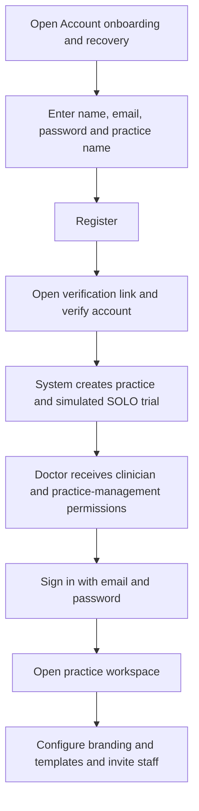
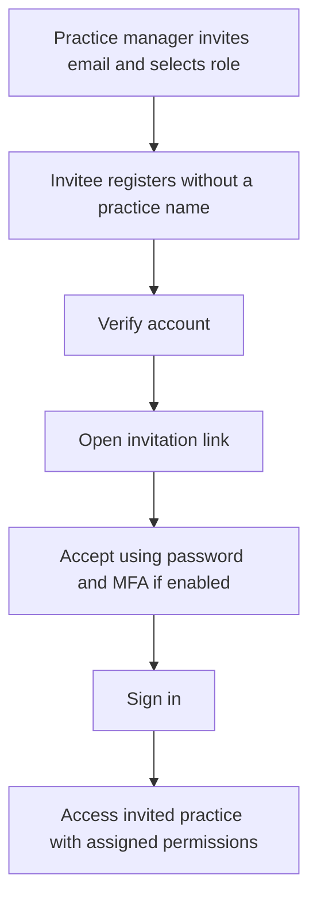
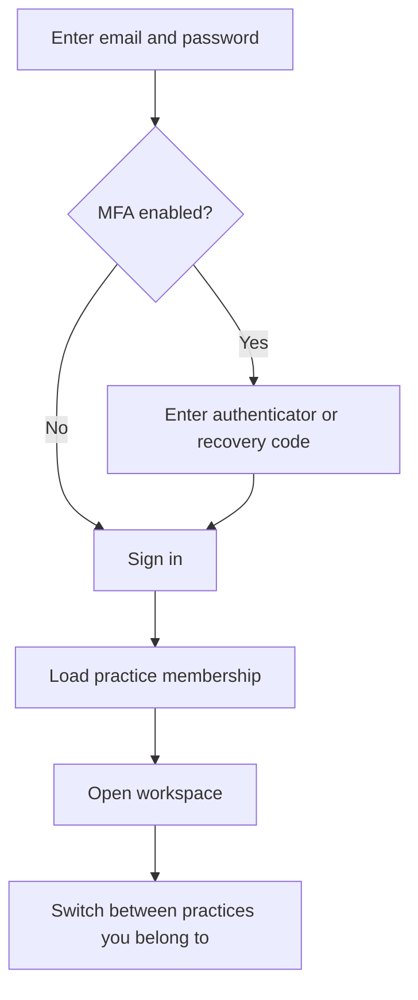
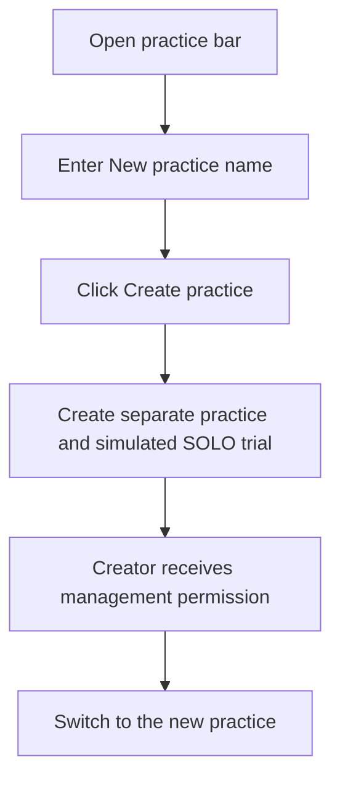

# Consolidated EHR Codex starter

> Current project: MCClinic includes a synthetic-data development MVP with clinical workflows, multiple practices and account onboarding. The original starter and foundation descriptions below are preserved as history. See the current account flows at the end of this README and the [onboarding runbook](Documentation/Project/ONBOARDING_RUNBOOK.md) for local setup.

Repository-local governance, six focused skills, EHR architecture, and concise committed session memory. This package contains documentation and templates; it does not include an application, approved implementation tasks, or live integrations.

## Install
1. Extract the ZIP. Copy the contents of `ehr-codex-project-starter/` into the target repository root, including hidden `.agents/`.
2. For an existing project, inspect and merge existing documents first. Do not blindly overwrite project history, approvals, or memory. Inventory overlapping Continuity/EHR skills and route each responsibility to the six skills in AGENTS.md. This package includes no competing legacy skills. Deleting existing legacy files requires explicit deletion approval; prepare the exact list for that approval and update obsolete references during the authorized consolidation.
3. Preserve the empty documentation directories. ZIP directory entries retain them on extraction. Each empty directory also contains `.gitkeep` so Git retains the structure; removal of those files follows the deletion rule.
4. Read session memory and AGENTS.md, inspect Git, and initialize PROJECT.md settings and product requirements. Keep project-specific clinical and jurisdictional decisions explicit.
5. Track and commit the kit and session memory in the project. Draft tasks and obtain explicit approval before application implementation.

## Ownership and workflow
AGENTS.md routes to one owner per concern: governance, assessment, development, review, session memory, and EHR architecture. No Jira or external task system is required. Use templates from `Documentation/Templates/`; every record is repository-local.

Requirements → assessment/findings → proposed task → explicit approval → approved task → existing branch search/reuse → task justification → implementation/test classification → verification/review → completed task and committed session memory.

Every implementation change is covered by `Documentation/Changes/Justification/<TASK-ID>-<description>.md`. There is no separate legacy documentation tree. Task approval does not implicitly approve deletions. The governance skill owns the complete deletion and approval rules; development owns KEEP/ADD/UPDATE/SPLIT/REMOVE test decisions.

## Start prompt
> Initialize this EHR repository using AGENTS.md and the six project-local skills. Read session memory first and validate it against Git. Establish project settings, draft Product/Foundation/Feature requirements from SCOPE.md, assess the repository, and propose bounded tasks with acceptance criteria. Do not implement application features until the proposed task has explicit approval. Update and commit concise repository-local session memory with the exact next action.

## Package map
- `AGENTS.md`, `README.md`: entry point and installation.
- `.agents/skills/`: six skills with distinct ownership.
- `Documentation/Project/`: project profile, scope, glossary.
- `Documentation/Requirements/{Product,Foundation,Features}/`: versioned requirements.
- `Documentation/Assessment/Findings/`: evidence-backed gaps.
- `Documentation/Architecture/Decisions/`: ADRs.
- `Documentation/Tasks/{Proposed,Approved,Completed}/`: task lifecycle.
- `Documentation/Acceptance/`: verification and review evidence.
- `Documentation/Changes/Justification/`: task implementation rationale.
- `Documentation/Session/SESSION_MEMORY.md`: committed continuation index.
- `Documentation/Templates/`: requirement, finding, task, ADR, acceptance, change-justification, and session-memory templates.

## Installed project — 2026-09-10
The kit is now installed at repository root. Begin with [session memory](Documentation/Session/SESSION_MEMORY.md), validate Git, then follow [AGENTS.md](AGENTS.md).
The nested starter is preserved unchanged as source material. Root overrides govern conflicts. All implementation justifications use `Doc/Changes/Justification/`; Jira is not used. See [requirements](Documentation/Requirements/INDEX.md), [tasks](Documentation/Tasks/Proposed/INDEX.md), and [assessment](Documentation/Assessment/INITIAL_ASSESSMENT.md).

## Development foundation
The approved TASK-001 workspace is implemented. See [local development](Documentation/Project/DEVELOPMENT.md) for pinned runtime, install, API/web startup and verification commands. This is a non-clinical shell; no patient workflow or prescribing capability is implemented. Remaining approved work is tracked in [decisions needed](Documentation/Assessment/DECISIONS-NEEDED.md).

## Current MVP account and practice flows

An **account identifies a person**. A **practice owns its subscription, patients and clinical records**. One account can belong to multiple practices with separate permissions. These flows describe the current local, synthetic-data implementation; they do not establish production identity verification or prescribing entitlement.

### 1. New doctor starting a practice

The practice is created after successful account verification. The platform owner does not need to create it manually. Passwords must contain 12–128 characters.

### 2. Staff member joining an existing practice

The manager sends invitations from **Account security and invitations**, choosing clinician, reception or administrator. An existing verified user skips registration and verification; the current invitation flow can be accessed from the sign-in page after signing out. Acceptance rechecks the inviter's authority and available clinician seats.

### 3. Returning user signing in

Switching practices changes the applicable permissions and visible records. Patients and clinical records are not automatically shared between practices. MFA recovery codes are single-use.

### 4. Signed-in user creating another practice

**Create practice is currently visible to signed-in practice users, including reception users.** It is not restricted to the platform owner or existing administrators. A clinician creator remains a clinician with management permission; a non-clinician creator becomes an administrator in the new practice. This grants no additional authority in other practices or platform administration.

### Development limitations and recovery

- Registration without a practice name is intended for invitation-based joining. A dedicated “no practice yet—create one or accept an invitation” journey is not established.
- Verification, invitation and password-reset messages go to the local development mailbox, not real email inboxes. Run `pnpm dev:mailbox` from the repository root, open the relevant link and complete the displayed action.
- To recover an account, request a reset link, open it from the local mailbox and enter a new password plus an authenticator or recovery code if MFA is enabled. A successful reset revokes existing sessions.
- Subscriptions are simulated; creating a practice does not charge anyone. Use synthetic data only. Clinical previews and prints remain marked **DEMO — NOT FOR CLINICAL USE**.

See the [onboarding runbook](Documentation/Project/ONBOARDING_RUNBOOK.md) for startup, verification, invitations, MFA and recovery instructions, and the [SaaS runbook](Documentation/Project/SAAS_RUNBOOK.md) for practice workflows.
## Packaged local testing

TASK-027 adds a complete Docker Compose environment with a built frontend, non-root API and persistent PostgreSQL `mcclinic`. LocalStack is optional and not required. Follow the [packaged runbook](Documentation/Project/PACKAGED_RUNBOOK.md) for startup, synthetic login, mailbox, health checks, backups and verification. The default local address is http://127.0.0.1:8080/clinic. This remains synthetic development; public staging/production are not enabled.
